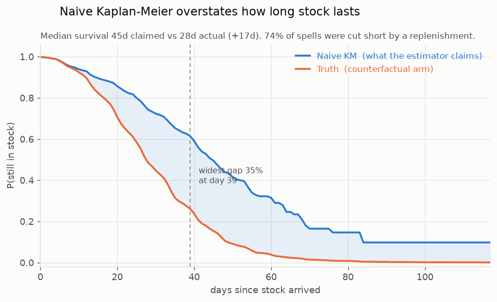
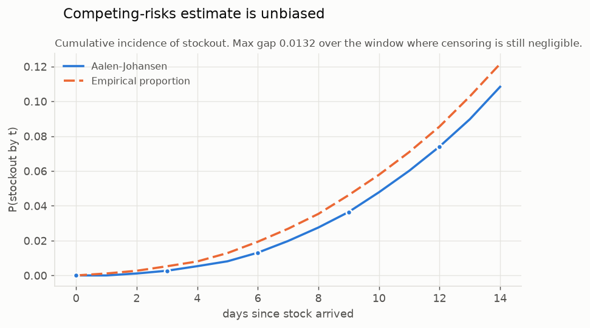
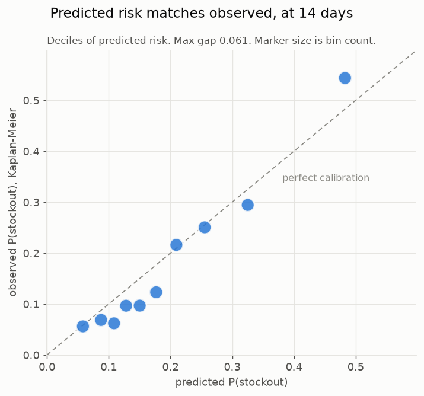
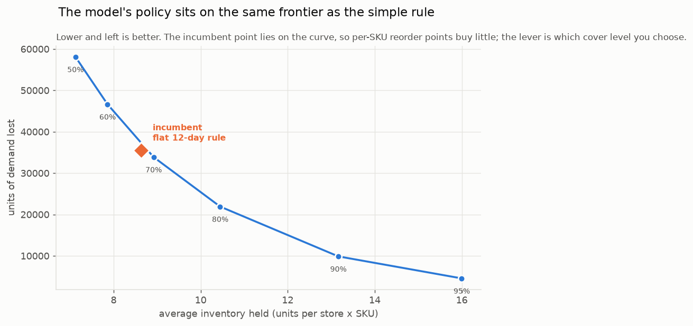

# Stockout survival model — results on synthetic data

Stage 2. Built and validated on the synthetic extract from Stage 1, whose stockout
process is known by construction. Reproduce with:

```bash
uv run scripts/generate_synthetic.py --profile dev --out data/synthetic --counterfactual
uv run scripts/fit_model.py          --input data/synthetic --out reports/model
uv run scripts/rank_critical_skus.py --input data/synthetic --horizon 14
uv run scripts/recommend_policy.py   --input data/synthetic --service-level 0.95 --backtest
uv run scripts/diagnose_network.py   --input data/synthetic
```

---

## Headline

| Question | Answer |
|---|---|
| Is plain Kaplan–Meier safe to use here? | **No.** It overstates median stock life by **17 days** (45 claimed vs 28 actual). |
| Can the bias be corrected from observed data? | **Only for the right question.** Aalen–Johansen recovers stockout incidence unbiased; the counterfactual "how long absent replenishment" is not identifiable. |
| Can the model rank SKUs by risk? | **Yes.** Held-out C-index **0.70**, calibration gap 0.06, no train/test gap. |
| Can it set better reorder points? | **No.** It sits on the same service/inventory frontier as a flat days-of-cover rule. |

The model's value is **triage, not policy**. That is a narrower claim than the
project started with, and it is the one the evidence supports.

---

## 1. Naive Kaplan–Meier is materially biased



Stage 1 predicted this; Stage 2 measures it. The simulator was run twice over
**identical latent demand** — once normally, once with replenishment disabled.
The second arm gives the true, uncensored time-to-stockout, which no real
business can observe.

| | Median survival | At day 28 |
|---|---|---|
| Naive KM (replenishment treated as censoring) | 45 days | 74% still in stock |
| Truth (counterfactual arm) | 28 days | 49% still in stock |

**74% of first spells are cut short by a replenishment.** Those are not random
dropouts: the reorder rule fires *because* stock is low, so the spells removed
from the risk set are precisely the ones about to fail. Kaplan–Meier assumes the
censored behave like the survivors, and here they emphatically do not.

Before making that claim, the harness was proved on data where the answer is
known: KM reproduces a hand-computed product-limit estimator to 1e-12, and equals
1 − ECDF exactly when nothing is censored. The bias is the estimator's, not the code's.

## 2. Competing risks answers a different — and more useful — question



Aalen–Johansen is **not a fixed-up Kaplan–Meier curve**. The two estimate
different things:

- **KM target:** P(no stockout by t) *if replenishment never happened*. Not
  identifiable from observed data.
- **Aalen–Johansen target:** P(stockout by t) *given the replenishment policy in
  force*. Identifiable, unbiased, and what a planner actually needs.

Validated two ways: the partition CIF(stockout) + CIF(replenished) + S(t) = 1
closes to **3.5e-14**, and over the window where censoring is still negligible the
fitted CIF matches the naive empirical proportion to **0.013**.

## 3. The regression: AFT, not Cox

The plan specified Cox. The data said otherwise, and the reason is mechanical.
Time to deplete is stock ÷ demand rate, so days of cover acts on the **time
scale** — double the cover and the SKU lasts roughly twice as long. That is an
accelerated-failure-time relationship. Cox instead assumes cover multiplies the
hazard by a constant at every point in time, which is false: cover determines
*when* the hazard rises, not by how much.

Held-out concordance, measured:

| Model | Test C-index |
|---|---|
| Cox, raw days of cover | 0.554 |
| Cox, log days of cover | 0.608 |
| Weibull AFT | 0.601 |
| **Log-normal AFT** | **0.678** |

On the full dev extract the final model reaches **C-index 0.6975 test vs 0.6972
train** — no overfitting — with a calibration gap of 0.061 against Cox's 0.161.



Coefficients, all with the sign physics demands (positive = survives longer):

| Feature | Effect |
|---|---|
| log days of cover | **+0.426** |
| log start stock | +0.254 |
| log trailing demand | **−0.252** |
| promotion days ahead | −0.055 |
| size extremity | +0.031 |

### A measurement problem worth knowing about

The coefficient on log days of cover *should* be ≈ 1.0 (double the cover, double
the life). It comes out at 0.35. That is **not** censoring bias — refitting with
the simulator's true demand rate gives 1.03 on the observed arm and 0.87 on the
counterfactual, both ≈ 1.

The cause is **regression dilution**: the trailing demand rate is a noisy
estimate, and noise in a regressor attenuates its coefficient. A size selling 0.2
units/day yields about 6 units in 28 days. Widening the window from 28 to 56 days
lifted the coefficient from 0.28 to 0.35.

**The highest-leverage improvement to this model is a better demand-rate
estimate**, not a better survival model.

## 4. Critical-SKU ranking

`reports/critical_skus.csv` — 2,581 open positions scored as of the last panel date.

For a position that has already survived `t0` days:

```
P(stockout within h)  = 1 - S(t0+h | x) / S(t0 | x)
expected_lost_units   = integral of predicted CIF over [0,h]  x  demand rate
expected_lost_revenue = expected_lost_units  x  avg_price
```

Both rankings ship, because they disagree: **the top 8 by probability and the top
8 by expected lost revenue overlap on only 1 SKU.** Ranking on risk alone sends a
planner to the wrong shelf. Total 14-day exposure across the network is 5,415
units; 1,057 of 2,581 positions carry above 50% stockout risk.

*Caveat:* expected lost units assume no replenishment arrives to rescue the
position, so this is **unmitigated exposure** — the right basis for choosing where
to intervene, not a forecast of what will happen.

## 5. Reorder points: an honest negative result



Two policies were derived and backtested by re-running the simulator.

**Inverting the survival model failed**, badly: +59% lost units at −13% inventory.
Two compounding causes. First, it inherits the optimistic censoring bias above, so
it under-provisions. Second and more fundamental, the incumbent rule reorders at 12
days of cover, so the data contains almost no examples of a position being allowed
to run down to 5 days. Asking the model what happens there is **off-policy
extrapolation** — the policy in force determines what you get to observe.

**A lead-time demand model works** and avoids both problems, because demand is
observed on every in-stock day regardless of the reorder rule. Using a negative
binomial (which keeps the overdispersion the textbook normal approximation throws
away) at 95% service: −87% lost units, +85% inventory.

But a single point proves nothing. Sweeping the service level traces the frontier,
and **the incumbent flat 12-day rule sits on that curve**:

| Service level | Units lost | Avg inventory | Fill rate |
|---|---|---|---|
| 50% | 58,091 | 7.12 | 83.0% |
| 60% | 46,633 | 7.86 | 86.3% |
| **incumbent flat 12d** | **35,554** | **8.64** | **89.6%** |
| 70% | 33,865 | 8.92 | 90.1% |
| 80% | 21,900 | 10.45 | 93.6% |
| 90% | 9,860 | 13.16 | 97.1% |
| 95% | 4,540 | 16.00 | 98.7% |

At matched inventory the difference is a few percent either way. **Per-SKU reorder
optimisation does not beat a well-chosen flat days-of-cover rule.** The lever that
moves the numbers is *which cover level you choose* — a service-level decision, not
a modelling one.

This is reported as found rather than tuned until it looked good.

## 6. Untracked transfers: model metrics will not warn you

Inter-store transfers happen and are not recorded. Injecting them into otherwise
clean synthetic data (`--defect untracked_transfers`) and re-running the whole
pipeline gives the most operationally important result in this report.

```bash
uv run scripts/diagnose_network.py --input data/synthetic
```

| | Clean | With untracked transfers |
|---|---|---|
| Spells | 23,192 | 24,601 (**+1,409 spurious**) |
| Ending in "replenished" | 10,976 | 13,085 |
| **Stockout events** | **9,595** | **8,936 (−6.9%)** |
| Held-out C-index | 0.697 | **0.769 (+0.072)** |

Two things to take from this.

**Transfers hide stockouts.** A transfer *in* raises stock with no order behind
it, so the spell builder reads it as a receipt: 520 of 26,971 inferred receipts
had no matching order. Those phantom receipts pre-empt real depletions, and the
recorded stockout count falls by 6.9%. The business would read a **better**
stockout rate than it actually has — the dangerous direction to be wrong in.

**Model quality is not a corruption detector.** The C-index went *up*, not down.
Corruption that manufactures clean, predictable spell boundaries makes the model
look better while it fits an artifact. Anyone validating this model on real data
by checking that the metrics look healthy would pass a corrupted extract.

The only thing that catches it is the accounting residual, which Stage 1 already
built. On the injected extract it fires precisely:

> `accounting.stock_movement_sign` — 935 of 522,143 transitions lose stock with
> no matching sale (3,485 units, 1.14% of sales)

**That residual is the measurement.** Run it on the real extract first: it sizes
untracked transfer volume before a line of modelling code is written, and tells
you whether capturing transfers is worth the integration work.

## 7. Store → DC mapping cannot be recovered

`Warehouse_ID` is a constant literal, so the network structure is invisible. But
`warehouse_stock` could in principle reveal it: two stores served by different DCs
should see different DC stock for the same SKU on the same day.

Run against the synthetic extract, the diagnostic correctly reports a **single
pool** — `warehouse_stock` is identical across every store on 100% of SKU-days,
making it a network total. On the real extract this is a cheap test worth running:
if the values partition the stores, those partitions *are* the DC catchments and
the mapping comes free. If they do not, allocation genuinely needs a new field.

---

## What this means for the real data

**Use the model for:** ranking which SKUs to look at, sized by expected lost
revenue. That is a real, validated capability.

**Do not use it for:** setting reorder points, or quoting an absolute "days until
stockout" from a Kaplan–Meier curve. The first is off-policy extrapolation; the
second is optimistic by roughly 60%.

**Three things that would change these conclusions**

1. **A goods-receipt date.** Lead time is currently *inferred* from order date →
   next stock rise (measured: mean 5.9d, sd 2.0d). Safety stock is more sensitive
   to lead-time variance than to its mean, so the inference inflates the buffer.
2. **A better demand-rate estimate.** The dominant error source, per the dilution
   finding above. Longer history, or shrinkage toward a category mean.
3. **Untracked inter-store transfers.** Measured in section 6: they hide 6.9% of
   stockouts and *raise* the C-index, so model metrics will not warn you. Run
   `accounting.stock_movement_sign` on the real extract before anything else.

**On transferring these numbers.** The synthetic generator was calibrated to the
schemas, not to your actual demand. The *methods* and the *failure modes* transfer;
the specific figures (17-day bias, C-index 0.70) must be re-measured on real data.
What does transfer with confidence is the direction of the KM bias and the reason
for it, both of which follow from the reorder policy rather than from any
parameter choice.
